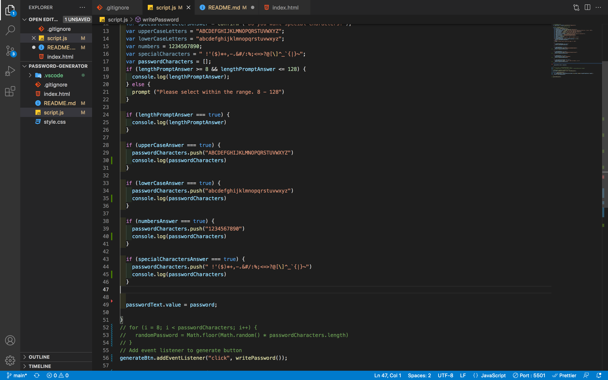

# password-generator

# Description

### If you're ever in need of a new password and cant come up with anything on the top of your head, this password generator is the place to be. This project give you the option to choose between uppercase letters, lowercase letters, numbers, and special characters. You can choose one of those option or all four options, your choice! You also have the option to choose the length which is minimum 8 characters and maximum 128 characters.

# Features

### Simply just click on the Generate Password button, then you will be asked a series of questions on which type of characters you'd prefer. After that, you randomly generated password will appear in the box right below. You have the option to repeat this same process as many times as you desire to get the perfect password with random characters.

# Usage

### 

### In the screenshot above shows the you will be asked a series of question and then when you answer yes, certain characters will be pushed into the array to randomize your password.

# Languages Used

### HTML, CSS, and JavaScript were used in this project.

# Link

### https://callanhunter.github.io/password-generator/
